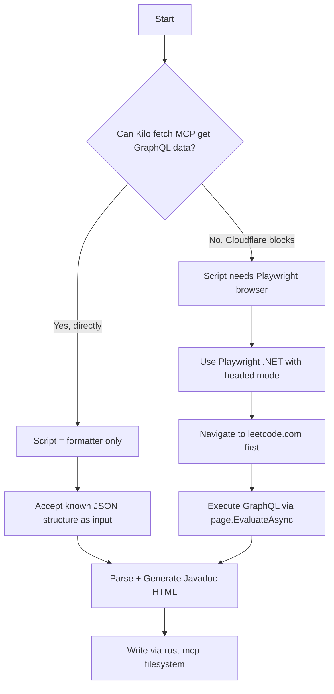

# Revised Plan: AGENTS.md Refactor + C# Playwright Scraper + Javadoc Standardization

## Overview (Revised per feedback)

Five workstreams with significantly more research phase before implementation.

---

## Phase 0: Verify Existing MCP Setup

Rust MCP filesystem and javadocs are **already** in the Docker MCP Toolkit profile. No add needed. Just verify they're
accessible.

---

## Phase 1: AGENTS.md Refactor — Spin Off Scraping Content as Playwright Skill

**Old plan:** Strip lines 34-176.
**Revised plan:**

1. Refactor AGENTS.md to keep core rules (lines 1-33) only
2. Extract lines 34-176 into a new document at `skills/playbook/playwright-scraping.md` with ALL recurrent failures
   documented
3. Read earlier Kilo chat history across Rider IDE, Zed editor, VSCode Kilo extension, and Kilo CLI
4. Enrich the playwright skill with ALL failure patterns from those chats

**Research needed:**

- Chat history locations: `%USERPROFILE%\.kilocode\` across extensions
- Recurrent failure patterns to document

---

## Phase 2: Global Skills Reference — Elevate SKILL.md

**Old plan:** Verify SKILL.md content.
**Revised plan:** Move ALL skills content as global skill reference including pwsh.

- The `skills/` directory structure stays but should be referenced globally
- Document the skill directory as a reusable knowledge base

---

## Phase 3: C# Scraper Script — Playwright for .NET

### Key changes from prior plan:

| Aspect         | Old Plan             | Revised                                                                                |
|----------------|----------------------|----------------------------------------------------------------------------------------|
| API layer      | HttpClient           | **Playwright for .NET** (`Microsoft.Playwright`)                                       |
| Input method   | CLI varargs          | **Inline config** — user sets question index inside the file                           |
| .NET version   | dotnet 10            | Research **both dotnet 10 and dotnet 11 preview**                                      |
| Scraping logic | Script does scraping | Formulate in real-time via Kilo fetch MCP, then hardcode known format                  |
| Script purpose | Scraper + writer     | **Data processor** (once scraping format is known, script just needs to format output) |

### Research steps (3a-d):

1. **3a**: Microsoft Learn MCP — research `Microsoft.Playwright` API for .NET 10/11
2. **3b**: Check dotnet 11 preview availability on this system
3. **3c**: Study Playwright .NET API at https://playwright.dev/dotnet/docs/api/class-playwright
4. **3d**: Determine if Playwright is needed at all once scraping logic is known — the C# script may just need file
   I/O + HTML formatting

### Architecture decision tree:



---

## Phase 4: Javadoc Standardization

### Key changes from prior plan:

**Revised approach:** Don't just strip NeetCode links. Standardize the ENTIRE Javadoc format.

### Research steps (4a-d):

1. **4a**: Examine previous Javadoc-related chats in IntelliJ Kilo extension chat history for this repo — understand
   what Javadoc format was previously agreed upon
2. **4b**: Standardize schema of tags employed — define which HTML tags are used and in what structure:
	- `<h1>` for title + LeetCode link
	- `<h2>` for major sections (Problem, Examples, Constraints)
	- `<h3>` for individual examples
	- `<pre>` for example blocks
	- `<ul>`/`<li>` for constraints
	- `<code>` for inline code
3. **4c**: Assess HTML vs Markdown in Javadoc — JDK 18+ added `@snippet` and Markdown support via `///` comments.
   Determine which format to use.
4. **4d**: Research markdown in Javadoc using javadocs MCP server — check if any newer Java solutions use Markdown
   comments

### Tag schema decision:

| Aspect           | HTML Javadoc (`/** ... */`)          | Markdown Javadoc (`///` or `///*`) |
|------------------|--------------------------------------|------------------------------------|
| JDK support      | All versions                         | JDK 18+ (JEP 413)                  |
| IDE rendering    | Standard in all IDEs                 | Requires newer IDE versions        |
| NeetCode removal | Search/replace `<p><b>NeetCode:</b>` | Same in both                       |

Likely conclusion: **Stay with HTML Javadoc** for backward compatibility since solutions span wide JDK range.

---

## Dependency Graph (Revised)

```
Research Phase
  ├── MCP verify (rust-mcp-filesystem, javadocs)
  ├── Fetch MCP test for LeetCode GraphQL
  ├── Microsoft Learn for Playwright .NET API
  ├── dotnet SDK version check (10 vs 11 preview)
  ├── Playwright docs review
  ├── Chat history review across IDEs
  ├── javadocs MCP for markdown research
  │
  v
Implementation Phase
  ├── Phase 1: AGENTS.md refactor + playwright skill
  ├── Phase 2: SKILL.md global ref
  ├── Phase 3: C# Playwright script + scraped format
  └── Phase 4: Javadoc standardization pass across all files
```
