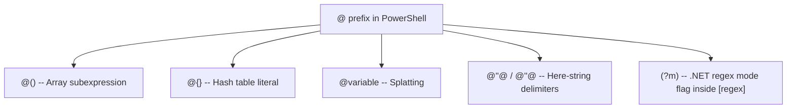

# Consolidated PowerShell Skill & Migration Plan

**Generated:** 2026-05-14
**Author:** Kilo Code Architect
**Purpose:** Comprehensive reference consolidating all `plans/` content, PowerShell quoting/parsing/array/hash-table
deep-dives, Microsoft Learn findings, Cheat Sheet PDF extraction, and migration roadmap segregated per file.

---

## Table of Contents

1. [Skill Autoloading: Kilo vs Copilot](#1-skill-autoloading-kilo-vs-copilot)
2. [PowerShell String Quoting Anti-Patterns](#2-powershell-string-quoting-anti-patterns)
3. [PowerShell Array `@()` vs Hash Table `@{}`](#3-powershell-array--vs-hash-table-)
4. [Terminal Invocation & Nested Invocation](#4-terminal-invocation--nested-invocation)
5. [Multi-Line Strings & Here-Strings](#5-multi-line-strings--here-strings)
6. [PowerShell Quick Reference PDF Summary](#6-powershell-quick-reference-pdf-summary)
7. [Microsoft Learn Collated Findings](#7-microsoft-learn-collated-findings)
8. [Migration Matrix: plans/ Files → Final Plan](#8-migration-matrix-plans-files--final-plan)

---

## 1. Skill Autoloading: Kilo vs Copilot

### GitHub Copilot's Mechanism

GitHub Copilot supports **`.github/copilot-instructions.md`** (and earlier `.github/copilot-instructions.md` files)
which are **automatically loaded** by Copilot based on the repository context. When a file with a certain extension is
opened, Copilot checks for matching instructions files and includes them in the prompt context.

### Kilo Code's Mechanism

**Kilo Code does NOT support extension-based autoloading of skill files.** The current implementation:

- Uses a single [`AGENTS.md`](AGENTS.md) file at the project root as a global instruction set for the AI assistant.
- The file [`plans/powershell-regex-skill.md`](plans/powershell-regex-skill.md) is a **static reference document** — it
  is NOT auto-loaded based on `.ps1` file extension or any other trigger.
- Kilo Code has no concept of "skills" that are dynamically attached based on workspace context or file extensions.

### Recommendation

If you want the PowerShell regex knowledge to be available automatically, the content should be **merged
into [`AGENTS.md`](AGENTS.md)** or referenced from there. Currently, the skill document is only useful as a manual
reference that the user must explicitly tell the AI to read.

**To update the SKILL properly:** Either:

- **(A)** Append/integrate the key content from [`plans/powershell-regex-skill.md`](plans/powershell-regex-skill.md)
  into [`AGENTS.md`](AGENTS.md) so it's part of the always-loaded instruction set.
- **(B)** Keep it as a standalone reference and reference it explicitly in prompts.

---

## 2. PowerShell String Quoting Anti-Patterns

### 2.1 The Four Quote Types

| Syntax    | Name                       | Variable Expansion    | Escape Sequences                             | Use Case                                |
|-----------|----------------------------|-----------------------|----------------------------------------------|-----------------------------------------|
| `'text'`  | Single-quoted (verbatim)   | No                    | Only `''` → `'`                              | Constant strings, regex patterns, paths |
| `"text"`  | Double-quoted (expandable) | Yes `$var`, `$(expr)` | Backtick: `` `n `, `` `r `, `` `t `, `` `0 ` | Strings with variables                  |
| `@'...'@` | Single-quoted here-string  | No                    | None                                         | Multi-line verbatim, JSON, XML, SQL     |
| `@"..."@` | Double-quoted here-string  | Yes `$var`, `$(expr)` | Backtick sequences                           | Multi-line with interpolation           |

### 2.2 Critical Anti-Patterns

#### Anti-Pattern 1: Double Quotes for Constant Strings

```powershell
# BAD: Double quotes imply expansion but no variables present
$path = "C:\Users\Public\Scripts"

# GOOD: Single quotes signal constant intent, no parsing overhead
$path = 'C:\Users\Public\Scripts'
```

#### Anti-Pattern 2: Confusing PowerShell Escape Sequences with Regex Escape Sequences

```powershell
# BAD: "`r`n" is PowerShell CR+LF characters, NOT regex \r\n
$text -replace "`r`n", ' '  # Replaces actual CR+LF chars (PowerShell escape)
# Equivalent to: $text -replace "`r`n", ' '

# GOOD: For regex pattern \r\n, use single quotes with literal backslash-r backslash-n
$text -replace '\r\n', ' '   # Regex pattern matching carriage-return + newline
```

**Key insight:** In double-quoted strings:

- `` "`r" `` = literal carriage return character (byte `0x0D`)
- `"\r"` = backslash followed by `r` (two characters)

In single-quoted strings:

- `'\r'` = backslash followed by `r` (two characters, literal)
- `'\r\n'` = regex pattern matching CR+LF

#### Anti-Pattern 3: Unescaped `$` in `-replace` Second Argument

```powershell
# BAD: $1 is interpreted as regex backreference
$text -replace 'old', '$1.00'

# GOOD: Escape the dollar sign
$text -replace 'old', '`$1.00'
# OR use [regex]::Escape()
$text -replace 'old', [regex]::Escape('$1.00')
```

#### Anti-Pattern 4: Using `-match` with `$matches` Inside Loops

```powershell
# BAD: $matches gets overwritten each loop iteration
foreach ($line in $lines) {
    if ($line -match '(pattern)') {
        $val = $matches[1]  # ← BUG: This is from the LAST -match in the iteration
    }
}

# GOOD: Use [regex]::Matches() with persistent MatchCollection
$pattern = [regex]'(pattern)'
foreach ($match in $pattern.Matches($text)) {
    $val = $match.Groups[1].Value  # Correct!
}
```

#### Anti-Pattern 5: `-replace` with Regex Metacharacters

```powershell
# BAD: '.' matches ANY character in regex
'foo.bar' -replace '.', 'X'  # Result: 'XXXXXXX' (every char replaced!)

# GOOD: Escape the dot
'foo.bar' -replace '\.', 'X'  # Result: 'fooXbar'
# OR
'foo.bar' -replace [regex]::Escape('.'), 'X'  # Same result
```

#### Anti-Pattern 6: Here-String Closing Delimiter on Same Line as Content

```powershell
# BAD: Closing "@ must be on its own line with no trailing content
$sql = @"
SELECT * FROM Users
WHERE Status = 'Active' "@

# GOOD: Closing "@ is on its own line, no characters before/after
$sql = @"
SELECT * FROM Users
WHERE Status = 'Active'
"@
```

#### Anti-Pattern 7: Passing Arguments with Spaces to Native Commands

```powershell
# BAD: PowerShell strips quotes before passing to native exe
cmd /c echo "hello world"  # Might not preserve quotes

# GOOD: Use --% stop-parsing token
cmd /c --% echo "hello world"

# OR use single quotes inside double quotes
cmd /c echo '"hello world"'
```

---

## 3. PowerShell Array `@()` vs Hash Table `@{}`

### 3.1 `@()` — Array Subexpression Operator

```powershell
# Creates an array of 0 or more objects
$empty = @()           # Empty array, Count = 0
$items = @(1, 2, 3)    # Array with 3 elements
$single = @('item')    # Array with 1 element (still an array!)

# Comma-separated list (equivalent, no @() needed)
$items = 1, 2, 3       # Same as @(1, 2, 3)

# Multi-line array declaration
$items = @(
    'Zero'
    'One'
    'Two'
)
```

**When to use `@()`:**

- Ensure result is always an array (even if command returns 0 or 1 object)
- Initialize empty arrays before adding items
- Wrap command output that might return `$null`

### 3.2 `@{}` — Hash Table Literal

```powershell
# Key-value store
$empty = @{}                    # Empty hashtable
$person = @{
    Name = 'Kevin'
    Age  = 36
    City = 'Austin'
}

# Access by key
$person['Name']                 # 'Kevin'
$person.Name                    # 'Kevin' (property-style)

# Add/update
$person['Zip'] = '78701'        # Using bracket syntax
$person.State = 'TX'            # Using property syntax
$person.Add('Country', 'USA')   # Using Add() method
```

**When to use `@{}`:**

- Lookup tables (map keys to values)
- Splatting parameters to cmdlets: `$params = @{...}; Get-Item @params`
- Creating structured data/objects (often with `[pscustomobject]`)
- Grouping related properties

### 3.3 Comparison Table

| Feature            | `@()` Array                    | `@{}` Hash Table                               |
|--------------------|--------------------------------|------------------------------------------------|
| **Structure**      | Ordered, indexed collection    | Key-value pairs unordered                      |
| **Access**         | `$a[0]`, `$a[-1]`              | `$h['key']`, `$h.key`                          |
| **Iteration**      | `foreach ($i in $a)`           | `foreach ($k in $h.Keys)`                      |
| **Count**          | `.Count` property              | `.Count` property                              |
| **Add items**      | `$a += 'new'` (expensive!)     | `$h.Add('k','v')` or `$h.k = 'v'`              |
| **Remove items**   | Not native (use `List`)        | `.Remove('key')`                               |
| **Contains check** | `$a -contains 'val'`           | `.ContainsKey('key')`, `.ContainsValue('val')` |
| **Use case**       | Ordered data, lists, sequences | Lookups, structured data, splatting            |

### 3.4 The `@` Prefix Ambiguity



### 3.5 Common Pitfall: `$null` Check with Arrays

```powershell
# BAD: -eq on array checks each ELEMENT, not the array itself
if ($array -eq $null) { }       # Wrong! Checks if any element is $null

# GOOD: $null on left side
if ($null -eq $array) { }       # Correctly checks if array is $null

# Best: check count after null check
if ($null -ne $array -and $array.Count -gt 0) { }
```

---

## 4. Terminal Invocation & Nested Invocation

### 4.1 Calling PowerShell from PowerShell

```powershell
# Basic invocation (simple command)
powershell -Command "Get-Process"

# Multi-statement
powershell -Command "Get-Process; Get-Service"

# With parameters requiring quoting
powershell -Command "& { param(`$path) Write-Host `$path } -path 'C:\test'"
```

### 4.2 The Nested Quoting Nightmare

When calling `powershell -Command` from within PowerShell, quoting becomes **recursive**:

```powershell
# Level 1: PowerShell calling PowerShell with a command that itself has quotes

# PROBLEM: How to pass a quoted string through nested invocation?
powershell -Command "Write-Host 'Hello World'"
# Outer shell: PowerShell interprets "..." and sees Write-Host 'Hello World'
# Inner shell: Interprets 'Hello World' as verbatim string

# However, if the inner command needs variables...
powershell -Command "Write-Host `"Value is `$env:PATH`""
# Outer: backtick escapes double-quotes and $ for the outer shell
# Inner: sees "Value is $env:PATH" and expands it

# Using -- to pass through
powershell -Command "Write-Host -- -InputObject"
```

### 4.3 The `$PSNativeCommandArgumentPassing` Preference (PowerShell 7.3+)

Controls how native executables receive arguments:

| Mode       | Behavior                                                                          | Default Platform |
|------------|-----------------------------------------------------------------------------------|------------------|
| `Legacy`   | Historic behavior, strips inner quotes                                            | —                |
| `Standard` | Preserves quotes in literal/expandable strings                                    | Non-Windows      |
| `Windows`  | Same as Standard, but `cmd.exe`, `.bat`, `.cmd`, `.js`, `.vbs`, `.wsf` use Legacy | Windows          |

```powershell
# Check current mode
$PSNativeCommandArgumentPassing

# Set mode
$PSNativeCommandArgumentPassing = 'Standard'
```

### 4.4 The Stop-Parsing Token `--%`

```powershell
# Passes everything after --% literally to native command
# ONLY environment variables like %PATH% are expanded
icacls X:\VMS --% /grant Dom\HVAdmin:(CI)(OI)F /T

# Without --%, parentheses would need escaping:
icacls X:\VMS /grant Dom\HVAdmin:`(CI`)`(OI`)F /T
```

### 4.5 Argument Mode vs Expression Mode

| Token                | Expression Mode | Argument Mode |
|----------------------|-----------------|---------------|
| `2`                  | integer 2       | string "2"    |
| `2+2`                | integer 4       | string "2+2"  |
| `Write-Output 2+2`   | —               | string "2+2"  |
| `Write-Output (2+2)` | integer 4       | integer 4     |
| `$a` (where `$a=4`)  | integer 4       | integer 4     |
| `Write-Output $a+2`  | —               | string "4+2"  |

### 4.6 Nested `powershell -Command` Anti-Patterns

```powershell
# Anti-Pattern: Triple-nested quoting
# PowerShell → cmd → powershell
cmd /c powershell -Command "Write-Host 'test'"
# Each layer strips/transforms quotes differently

# Safer: Base64-encoded command
$command = 'Write-Host "Hello World"'
$bytes = [Text.Encoding]::Unicode.GetBytes($command)
$encoded = [Convert]::ToBase64String($bytes)
powershell -EncodedCommand $encoded

# Or use -File with a temp script
$script = [System.IO.Path]::GetTempFileName() + '.ps1'
'Write-Host "Hello World"' | Set-Content $script
powershell -File $script
```

---

## 5. Multi-Line Strings & Here-Strings

### 5.1 Here-String Rules

| Aspect                 | `@"..."@`                                      | `@'...'@`              |
|------------------------|------------------------------------------------|------------------------|
| Variable expansion     | Yes                                            | No                     |
| Escape sequences       | Yes (backtick)                                 | No (literal)           |
| Quotation marks inside | Literal                                        | Literal                |
| Opening delimiter      | Must be at end of line (followed by newline)   | Same                   |
| Closing delimiter      | Must be at start of line (preceded by newline) | Same                   |
| Final newline          | NOT included in string                         | NOT included in string |

### 5.2 Here-String Examples

```powershell
# Double-quoted here-string (variables expanded)
$name = 'Kilo'
$greeting = @"
Hello $name,
Welcome to the system.
Your path is: $env:USERPROFILE
"@

# Single-quoted here-string (verbatim, for literal $)
$verbatim = @'
The $PATH variable is not expanded here.
Literal quotes like " and ' are fine.
'@

# Here-string for JSON/XML
$json = @"
{
    "name": "Kilo",
    "version": 1.0
}
"@
```

### 5.3 Multi-Line Without Here-Strings (PowerShell 7+)

PowerShell allows multi-line strings without `@` delimiters:

```powershell
$multi = "Line 1
Line 2
Line 3"
```

However, **here-strings are the preferred syntax** for clarity.

---

## 6. PowerShell Quick Reference PDF Summary

**Source:** `C:\Users\Lance\Desktop\PowerShellQuickReference-PowerShell7.0-v1.03.pdf`

| Section            | Key Content                                                                                                                                                                                            |
|--------------------|--------------------------------------------------------------------------------------------------------------------------------------------------------------------------------------------------------|
| **Operators**      | Comparison (`-eq`, `-like`, `-match`), Logical (`-and`, `-or`, `-not`), Type (`-is`, `-as`), Format (`-f`), Bitwise (`-band`, `-bor`, `-shl`), Range (`..`), Redirection (`>`, `>>`, `2>`, `3>`, etc.) |
| **New in 7.0**     | Ternary operator `? :`, Pipeline chain `                                                                                                                                                               ||` `&&`, Null coalescing `??` `??=`, `ForEach-Object -Parallel` |
| **Variables**      | `$Global:`, `$Local:`, `$Private:`, Multi-assignment, Read-only, Constant, `[ValidateRange()]`                                                                                                         |
| **Arrays**         | `@()`, comma operator, `$a[0]`, `$a[-1]`, `$a[1..3]`, `$a.Count`, `[array]::Reverse()`, `+` to combine                                                                                                 |
| **Strings**        | `'verbatim'`, `"expandable $var"`, `@"..."@` here-string, `@'...'@` here-string                                                                                                                        |
| **Hash Tables**    | `@{}`, `$h.Key`, `$h['Key']`, `.Add()`, `.Remove()`, `.GetEnumerator()`, `[ordered]`                                                                                                                   |
| **Comments**       | `# single line`, `<# multi-line #>`                                                                                                                                                                    |
| **Loops**          | `foreach`, `ForEach-Object`, `ForEach-Object -Parallel`, `Do While`, `Do Until`, `For`                                                                                                                 |
| **Error Handling** | `Try/Catch`, `$Error`, `Get-Error` (new in 7.0)                                                                                                                                                        |
| **Modules**        | `Get-Module`, `Import-Module`, `Find-Module`, `Install-Module`                                                                                                                                         |
| **History**        | `Get-History`, `Invoke-History`, `Clear-History`                                                                                                                                                       |

---

## 7. Microsoft Learn Collated Findings

### 7.1 about_Quoting_Rules

**Source:
** [about_Quoting_Rules](https://learn.microsoft.com/en-us/powershell/module/microsoft.powershell.core/about/about_quoting_rules?view=powershell-7.6)

Key findings:

1. **Smart quotes** (curly/typographic quotes `'' ""`) are treated as normal quotation marks by PowerShell — they still
   need escaping.
2. **`$()` subexpression** is required for member access on variables inside double-quoted strings:
   `"$($PSVersionTable.PSVersion)"` not `"$PSVersionTable.PSVersion"`.
3. **Braces `{}`** after `$` separate variable names from subsequent characters: `"${HOME}: path"` works but
   `"$HOME: path"` fails (colon is scope specifier).
4. **Culture invariance**: `"$x"` uses invariant culture (`.` decimal separator), while `$x.ToString()` uses current
   culture (`,` in `de-DE`).
5. **`$OFS`** (Output Field Separator) controls array-to-string joining in expandable strings.

### 7.2 about_Parsing

**Source:
** [about_Parsing](https://learn.microsoft.com/en-us/powershell/module/microsoft.powershell.core/about/about_parsing?view=powershell-7.6)

Key findings:

1. **Expression mode**: Numbers treated as numbers, operators work, quotes required for strings.
2. **Argument mode**: Everything is an expandable string unless prefixed by `$`, `@`, `(`, `{`, `'`, `"`.
3. **Comma in argument mode**: Creates arrays for PowerShell commands, literal commas for native commands.
4. **`--%` (stop-parsing)**: Only `%VAR%` environment variables expanded, rest is literal. Effective until newline or
   pipe.
5. **`--` (end-of-parameters)**: POSIX convention. Following values NOT interpreted as parameters.
6. **Line continuation**: Backtick at line end. Better to use natural break points: after `|`, `,`, `{`, `(`, binary
   operators, or use splatting.
7. **PowerShell 7.3 change**: `$PSNativeCommandArgumentPassing` controls native command argument handling.

### 7.3 about_Arrays

**Source:
** [about_Arrays](https://learn.microsoft.com/en-us/powershell/module/microsoft.powershell.core/about/about_arrays?view=powershell-7.6)

Key findings:

1. **`@()`** always returns an array (0, 1, or N items).
2. **Negative indexing**: `$a[-1]` = last item, `$a[-2]` = second-to-last.
3. **Multiple indices**: `$a[0,2,3]` returns items at positions 0, 2, 3.
4. **Range operator**: `$a[1..3]` items 2-4, `$a[3..1]` reversed.
5. **`0..-1` trap**: Evaluates to `0, -1` (first and last), NOT all items.
6. **Out of bounds**: Returns `$null` silently (no exception).
7. **`$null.Count`**: Returns `0`, not an error.
8. **Strongly-typed arrays**: `[int[]] $numbers = 1,2,3`.
9. **Generic `List[T]`**: Prefer `[System.Collections.Generic.List[int]]` over `ArrayList` (deprecated).
10. **`.ForEach()` method**: `$data.ForEach({...})` added in PowerShell 4.0.

### 7.4 about_Hash_Tables

**Source:
** [Everything about hashtables](https://learn.microsoft.com/en-us/powershell/scripting/learn/deep-dives/everything-about-hashtable?view=powershell-7.6)

Key findings:

1. **BadEnumeration**: Cannot modify a hashtable while iterating `.Keys`. Clone first: `$h.Keys.Clone()` or cast
   `@($h.Keys)`.
2. **`[ordered] @{}`**: Preserves insertion order.
3. **Splatting**: `@variable` (not `$variable`) invokes splatting.
4. **Multi-key access**: `$h['key1','key2']` returns multiple values.
5. **Nested hashtables**: `$h.key.subkey` for deep access.
6. **JSON round-trip**: Use `ConvertTo-Json -Depth N` for deep hashtables (default Depth may truncate).
7. **`$Matches`**: Automatic variable from `-match` operator, supports named captures: `(?<name>pattern)`.
8. **Deep copy**: Use `[System.Management.Automation.PSSerializer]::Serialize()`/`::Deserialize()` for reliable deep
   cloning.

### 7.5 Terminal Errors from String Parsing Issues

Common failure modes:

| Symptom                                   | Root Cause                                              | Fix                                                       |
|-------------------------------------------|---------------------------------------------------------|-----------------------------------------------------------|
| Native command receives wrong args        | PowerShell strips/transforms quotes                     | Use `--%` or `$PSNativeCommandArgumentPassing = 'Legacy'` |
| `Cannot index into a null array`          | Variable is `$null` when accessed as array              | Check `$null` first                                       |
| `Collection was modified`                 | Modifying hashtable during enumeration                  | Clone keys first                                          |
| Regex `$` anchor doesn't match on Windows | CRLF line endings; `$` matches before `\n` only         | Strip `\r` or use `\r?$`                                  |
| `-replace` produces wrong result          | `$1` in replacement string interpreted as backreference | Use `'`$1'` or `[regex]::Escape()`                        |
| JSON truncated on round-trip              | `ConvertTo-Json` default Depth (2) too shallow          | Use `-Depth 10` or higher                                 |

---

## 8. Migration Matrix: plans/ Files → Final Plan

### 8.1 Plans Directory Inventory

| File                                                                                       | Type      | Content Summary                                                                  | Migration Action                                                                         |
|--------------------------------------------------------------------------------------------|-----------|----------------------------------------------------------------------------------|------------------------------------------------------------------------------------------|
| [`plans/powershell-regex-skill.md`](plans/powershell-regex-skill.md)                       | Reference | .NET regex `$` anchor with CRLF, `$matches` anti-patterns, quoting in `-replace` | **Keep as standalone reference** — content integrated into this document Section 2 & 7.5 |
| [`plans/assemble_catalog.ps1`](plans/assemble_catalog.ps1)                                 | Script    | Assembles per-version JDK feature JSON files into aggregated catalog             | **Keep as-is** — standalone utility script                                               |
| [`plans/build_modernization_matrix.py`](plans/build_modernization_matrix.py)               | Script    | Cross-references JDK 9-26 features against repo code                             | **Keep as-is** — standalone utility script                                               |
| [`plans/guava_analysis.md`](plans/guava_analysis.md)                                       | Analysis  | Guava library relevance analysis (verdict: don't add)                            | **Keep as-is** — final analysis already complete                                         |
| [`plans/jdk_features_catalog.json`](plans/jdk_features_catalog.json)                       | Data      | 101 JDK 9-26 features with metadata                                              | **Keep as-is** — data source for modernization_matrix                                    |
| [`plans/jdk_features_research_methodology.md`](plans/jdk_features_research_methodology.md) | Research  | How to correctly research JDK features (javaalmanac, JEP index)                  | **Keep as-is** — methodology reference                                                   |
| [`plans/modernization_matrix.json`](plans/modernization_matrix.json)                       | Data      | File-to-feature applicability mapping                                            | **Keep as-is** — data output                                                             |
| [`plans/modernization_report.md`](plans/modernization_report.md)                           | Report    | Top 10 features, file opportunities, adoption roadmap                            | **Keep as-is** — final report                                                            |
| [`plans/jdk_features/`](plans/jdk_features/)                                               | Directory | Per-version JDK feature JSON files (jdk09-jdk26)                                 | **Keep as-is** — source data                                                             |

### 8.2 Segregation by File Purpose

```
plans/
├── final_migration_plan.md        ← THIS FILE — consolidated reference
│
├── README.md                      ← [PROPOSED] Index pointing to all plans
│
├── powershell-regex-skill.md      ← STANDALONE — PowerShell regex reference
├── guava_analysis.md              ← STANDALONE — Guava analysis (complete)
├── jdk_features_research_methodology.md  ← STANDALONE — Research methodology
├── modernization_report.md        ← STANDALONE — Final modernization report
│
├── assemble_catalog.ps1           ← UTILITY — JDK catalog assembler
├── build_modernization_matrix.py  ← UTILITY — Modernization matrix builder
│
├── jdk_features_catalog.json      ← DATA — JDK feature catalog
├── modernization_matrix.json      ← DATA — Modernization opportunities
│
└── jdk_features/                  ← DATA — Per-version JDK feature files
    ├── index.json
    ├── jdk09_features.json
    ├── jdk10_features.json
    └── ...
```

### 8.3 Action Items for Consolidation

1. **`[plans/powershell-regex-skill.md](plans/powershell-regex-skill.md)`**: Already handled. Its content is now
   cross-referenced and enriched in this document. The original file may remain as a quick-reference standalone.

2. **AGENTS.md Integration**: If the PowerShell regex skill should be auto-loaded, key anti-pattern content should be
   added to [`AGENTS.md`](AGENTS.md) under a new section like `## PowerShell Regex on Windows`.

3. **No files need deletion** — all serve distinct purposes (analysis, data, scripts, reference).

---

## Appendix A: Regex Engine Quick Reference

| Token             | .NET / PowerShell Behavior            |
|-------------------|---------------------------------------|
| `$` (no `(?m)`)   | End of string only                    |
| `$` (with `(?m)`) | Before `\n` ONLY (not `\r`)           |
| `\A`              | Start of string (ignores multiline)   |
| `\z`              | End of string (ignores multiline)     |
| `\Z`              | End of string or before `\n` at end   |
| `(?m)`            | Multiline: `^`/`$` at line boundaries |
| `(?s)`            | Singleline: `.` matches `\n`          |
| `.` (no `(?s)`)   | All except `\n` (includes `\r`)       |

**Windows CRLF Handling:** Strip `\r` before multiline regex, or use `\r?$` instead of bare `$`.

## Appendix B: Safe Quoting Cheat Sheet

| Goal                              | Correct Syntax                                  |
|-----------------------------------|-------------------------------------------------|
| Literal string                    | `'text'`                                        |
| String with variable              | `"Value: $var"`                                 |
| String with expression            | `"Result: $(2+2)"`                              |
| Regex pattern                     | `'pattern'` (single quotes)                     |
| Regex with variable               | `"pattern$var"` (double, backslash escapes)     |
| Multi-line literal                | `@'...'@`                                       |
| Multi-line expandable             | `@"..."@`                                       |
| Escape `$` in double quotes       | `` "`$var" ``                                   |
| Escape `"` in double quotes       | `""""` or `` "`"" ``                            |
| Escape `'` in single quotes       | `'don''t'`                                      |
| Native command with special chars | `--% native.exe args...`                        |
| Parameter splatting               | `$params = @{...}; Cmdlet @params`              |
| Prevent array unwrap              | `Write-Output -NoEnumerate $array` or `,$array` |
